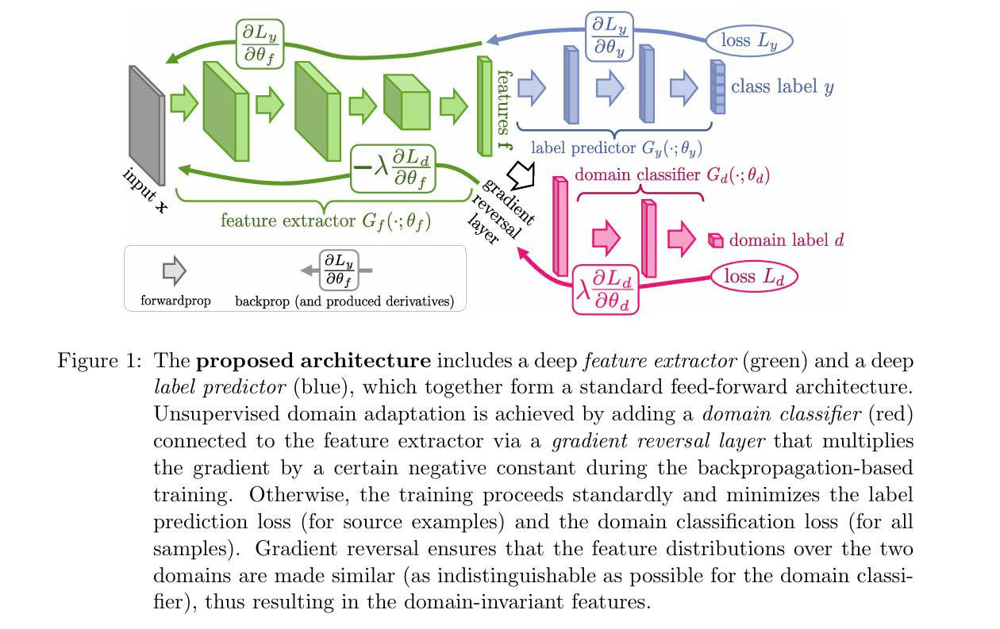
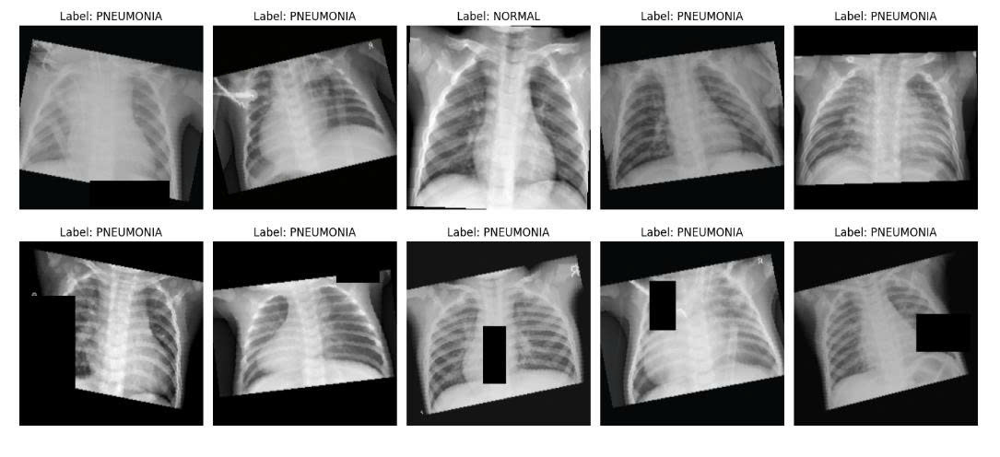

# Robust Pneumonia Detection in Chest X-Ray using Domain-Adversarial Neural Networks (DANN)  
# 📌 Tổng quan dự án  
Dự án này tập trung vào việc phát triển một hệ thống phân loại ảnh y tế (X-quang phổi) có khả năng chống chịu tốt với sự biến đổi dữ liệu (domain shift). Thay vì chỉ huấn luyện thông thường, chúng tôi sử dụng kiến trúc DANN để ép mô hình học các đặc trưng không phụ thuộc vào thiết bị chụp hay điều kiện ánh sáng (Domain-invariant features).  
Điểm đổi mới: Sử dụng chiến thuật Simulated Domain Shift. Tập dữ liệu được chia đôi:  
+ Source Domain: Áp dụng augmentation cơ bản.  
+ Target Domain: Áp dụng Heavy Augmentation để mô phỏng dữ liệu từ các nguồn khác nhau.  
# 🏗 Kiến trúc hệ thống  
  
Hệ thống dựa trên backbone ResNet-18 và được chia thành 3 phần chính thông qua lớp Gradient Reversal Layer (GRL):  
+ Feature Extractor G_f: Trích xuất đặc trưng cốt lõi từ ảnh X-quang.  
+ Label Classifier G_y: Phân loại bệnh (Normal vs Abnormal).  
+ Domain Discriminator G_d: Phân biệt ảnh đến từ Source (sạch) hay Target (nhiễu).  
Thông qua GRL, Feature Extractor bị ép phải học cách "đánh lừa" Domain Discriminator, từ đó loại bỏ các đặc trưng nhiễu không cần thiết cho việc chẩn đoán.  
# 📊 Dataset   
  
+ Tên: Chest X-Ray Images (Pneumonia).  
+ Nguồn: https://www.kaggle.com/datasets/paultimothymooney/chest-xray-pneumonia  
+ Cấu trúc: Gồm 3 thư mục chính train, val, test với hai nhãn: Normal và Pneumonia.   
# 📊 Chiến thuật dữ liệu & Augmentation  
Dữ liệu được lấy từ bộ Chest X-Ray Images (Pneumonia).  
🌓 Simulated Domain Shift  
Source Dataset (50%): Chỉ Resize và Normalize. Giúp mô hình học cấu trúc chuẩn.  
Target Dataset (50%):  
+ ColorJitter: Thay đổi độ sáng, độ tương phản cực đại.  
+ GaussianBlur: Mô phỏng ảnh chất lượng thấp.  
+ RandomGrayscale: Mô phỏng thiết bị cũ.  
+ RandomRotation: Mô phỏng tư thế bệnh nhân không chuẩn.  
# 🚀 Cấu hình tham số  
+ LEARNING_RATE_MAX = 0.01  
+ LEARNING_RATE_MIN = 0.0001  
+ WEIGHT_DECAY = 0.0001  
+ NUM_EPOCHES = 10  
+ NUM_CLASSES = 2  
+ P_DROPOUT = 0.25  
# 📈 Kết quả đạt được  
Hệ thống đánh giá dựa trên các chỉ số y tế quan trọng:  
+ Precision = 0.8081 : Độ chính xác trong các ca dự đoán mắc bệnh.  
+ Recall = 0.8286 : Khả năng không bỏ sót ca bệnh (Cực kỳ quan trọng trong y tế).  
+ F1-Score = 0.8060 :  Sự cân bằng giữa Precision và Recall.  
# 💻 Installation & Setup  
Môi trường UV: Python 3.9 + 
# 🤝 Contributing  
Đóng góp này chỉ với mục đích kiểm thử trên tài liệu đã được công bố.  
Nguồn tài liệu tham khảo tại đây: https://arxiv.org/pdf/1505.07818  
